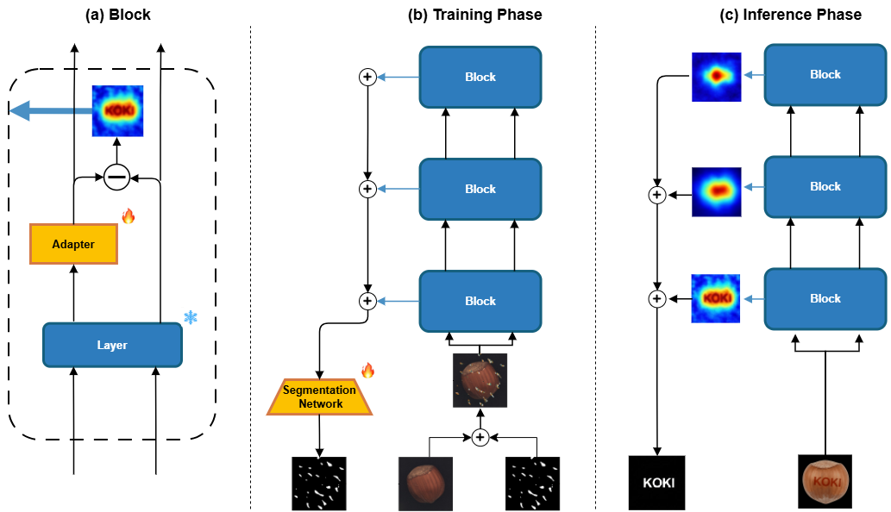
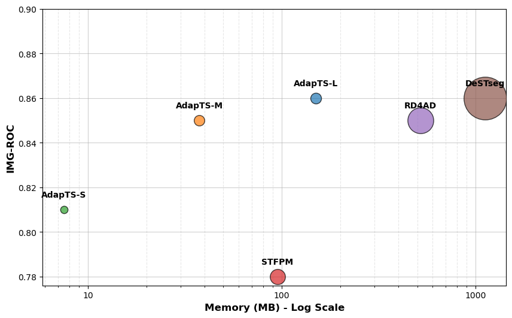

# AdapTS: Lightweight Teacher-Student Approach for Multi-Class and Continual Visual Anomaly Detection.

Abstract:

<i>Visual Anomaly Detection (VAD) is crucial for industrial inspection, yet most existing methods are limited to single-category scenarios, failing to address the multi-class and continual learning demands of real-world environments. While Teacher-Student (TS) architectures are efficient, they remain unexplored for the Continual Setting. To bridge this gap, we propose AdapTS, a unified TS framework designed for multi-class and continual settings, optimized for edge deployment. AdapTS eliminates the need for separate TS networks by utilizing a single shared frozen backbone and injecting lightweight trainable adapters into the student pathway. Training is enhanced via a segmentation-guided objective and synthetic Perlin noise, while a prototype-based task identification mechanism dynamically selects adapters at inference with 99\% accuracy.
Experiments on MVTec AD and VisA demonstrate that AdapTS matches or surpasses existing TS methods across single-class, multi-class, and continual learning scenarios, while drastically reducing memory overhead.  Our lightest variant, AdapTS-S, requires only 8 MB of additional memory, 13x less than STFPM (95 MB), 48x less than RD4AD (360 MB), and 149x less than DeSTSeg (1120 MB), making it a highly scalable solution for edge deployment in complex industrial environments.</i>


## AdapTS Architecture



## Performance - Memory tradeoff



## Experimental Setup:

The file `main_stfpm_adapters_noisy.py` is the entry point for training all AdapTS versions for all the considered settings.
For training the adpaters:

```
python main_stfpm_adapters_noisy.py --mode adapters --model_name wide_resnet50_2 --dataset visa --layers_idx layer1 layer2 layer3 --epochs 30 --batch_size 32 --device cuda:2 --wandb
```

The file `main_rd4ad.py` is the entry point for training RD4AD for all the considered settings.

The `/destseg` directory contains the adpated code for training DeSTSeg on single, joint and continual settings.
